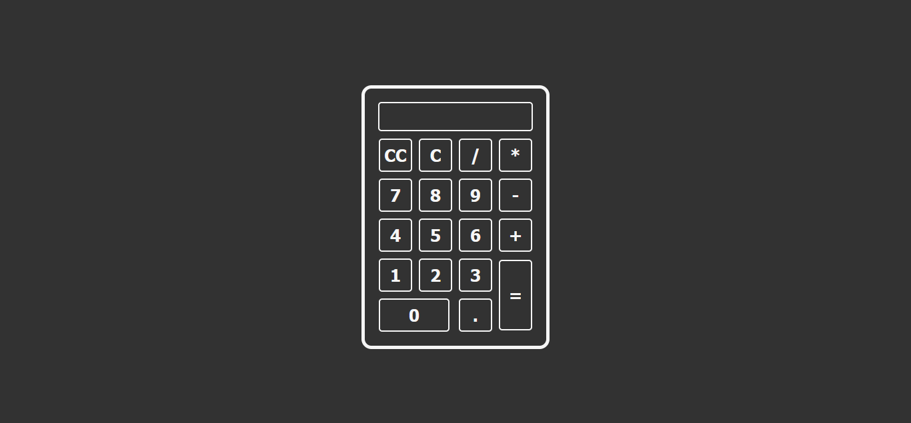

# Calculadora

Projeto de Calculadora simples em HTML, CSS e Javascript.

## Autores

- [@andre-dev-2021](https://www.github.com/andre-dev-2021)

## Screenshots

## Referência

 - [Tutorial Calculadora Javascript](https://programadoresdepre.com.br/como-criar-uma-calculadora-com-html-css-e-javascript/)
 
